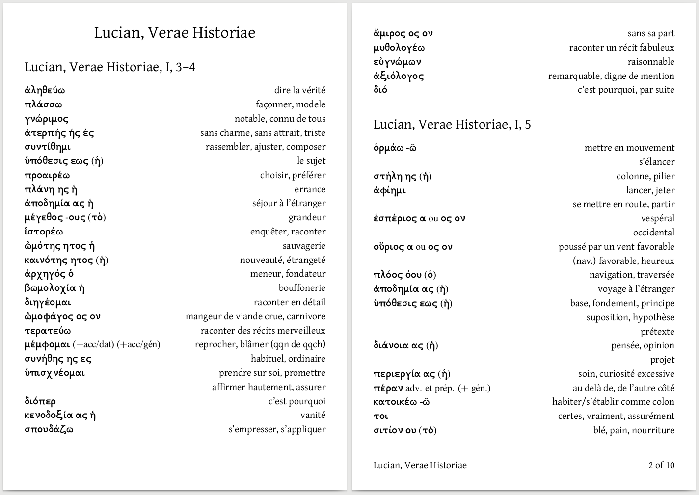
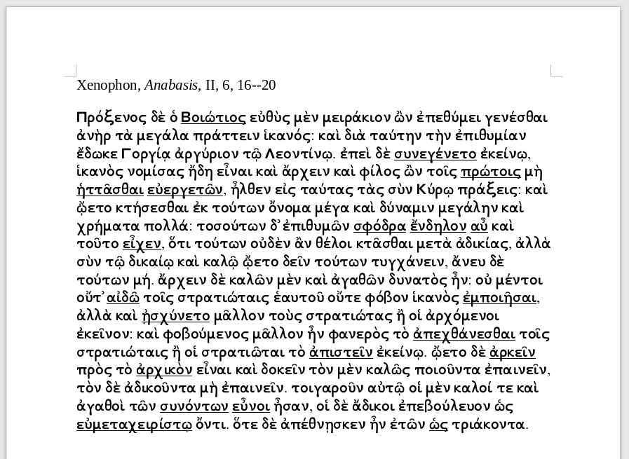
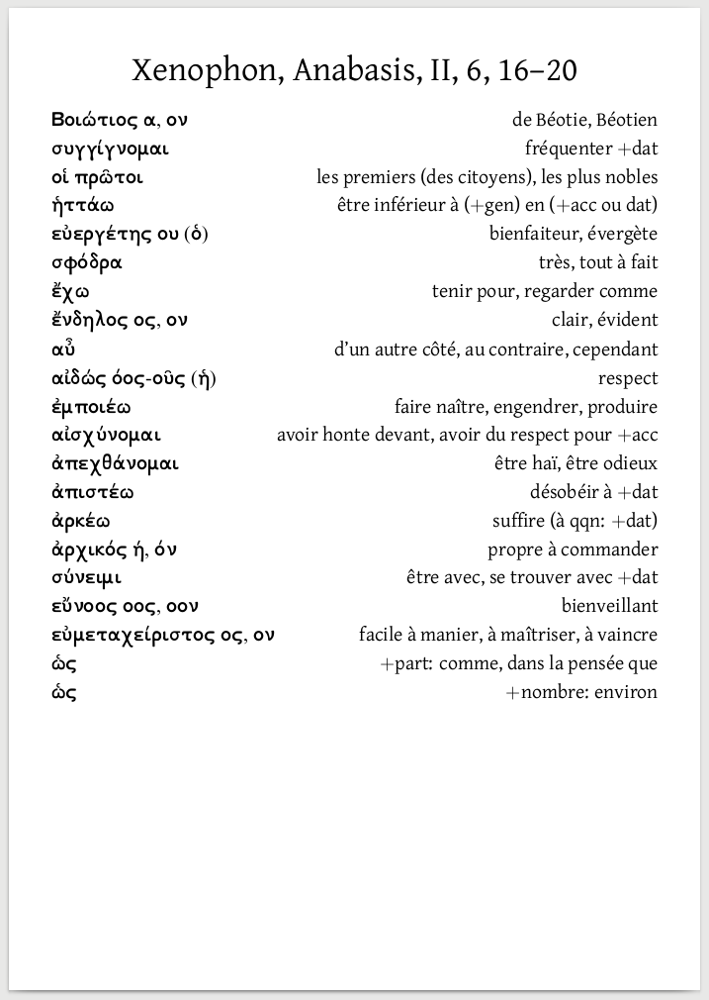

# Making semi-automatic word lists to study a text in a foreign language


## Introduction

When studying a foreign language, it is useful to learn vocabulary in
context: I used to make vocabulary lists to record unknown words for
each text I studied, so when I revised the vocabulary list I was able to
remember both the word and the context.

I designed a workflow and a series of scripts to build in a
semi-automatic way to build vocabulary lists from raw texts.  Here is the
workflow:

- copy the text in Microsoft Word or LibreOffice Writer, read the text
  and underline unkown words,
- extract the underlined words, with a script which will also get their lemmas
  (that is, the form under which they are recorded in the dictionary, for
  example `cats -> cat`); clean this list (remove unwanted lemmas, add
  some more, etc.),
- extract dictionary definitions, again with a script and clean them
  (choose between various meanings, remove or adde examples, etc.),
- transform the list to a `.tex` file, again with a script, and make a
  pdf out of it.

You get, for example, for Ancient Greek (2 pages are presented side by
side):





## Complete example of the workflow

I will use Ancient Greek as an example, but the workflow can be adapted
to other languages (I have used it for Latin, English, German).  You
will need some knownledge of the command line, but it should work on
Mac OS, Linux and Windows (with Cygwin).

The first step is to copy the text you want to study in Microsoft Word or
LibreOffice Writer, read it and underline the unknown words.  Here is an
example from Xenophon's _Anabasis_:



Save the text in the `.odt` format (even with Microsoft Word), because
this is an open source format that can be read by non-proprietary
programs.  Let's say you have saved it under the name
`xenophon_anabasis.odt`.

Run the following command to extract the words and get the lemmas (or
_lemmata_).  Lemmas are searched by requiring pages from the [Perseus
website](http://www.perseus.tufts.edu/hopper/):

```bash
python3 extract_words.py xenophon_anabasis.odt | \
   perl getlemmata.pl  -i /dev/stdin -o xenophon_anabasis.list
```

You will get a `xenophon_anabasis.list` file, containing the lemmas.
Open it with a text editor (Gedit, Text Editor, Notepad, etc.):

```
# The lemmata found on Perseus are:
# for word βοιωτιος:
Βοιώτιος
# for word συνεγενετο:
συγγίγνομαι
# for word πρωτοις:
πρότερος
πρῶτος
πρωτός
# for word ηττασθαι:
ἡσσάομαι
# for word ευεργετων:
εὐεργέτης
εὐεργετέω
...
```

(Only the beginning of the file is shown.)

Based on your knowledge of the language and of the text, try to select
the correct the correct lemma when there are several choices, because
one word form may be related to several lemmas (as in English: "axes"
may be the plural of "ax(e)" or of "axis").  Lines starting with a
hashtag are ignored.  So you may end up with something like:

```
# The lemmata found on Perseus are:
# for word βοιωτιος:
Βοιώτιος
# for word συνεγενετο:
συγγίγνομαι
# for word πρωτοις:
πρῶτος
# for word ηττασθαι:
#ἡσσάομαι
ἡττάω
# for word ευεργετων:
εὐεργέτης
...
```

You may also add lemma that have not been found, if you have looked up a
word in another dictionary.  Save the file, for instance in
`xenophon_anabasis.list-cleaned`.  Now run the `simdic.pl` script to get
the definitions from a dictionary you specify with the `-d` option:

```bash
perl simdic.pl -d /tmp/bailly.dic < xenophon_anabasis.list-cleaned \
   > xenophon_anabasis.voc
```

For each word in the cleaned list, dictionary definitions have now been
added in the resulting `xenophon_anabasis.voc` file:

```
Βοιώτιος α, ον   ::de Béotie, Béotien ; (en mauv. part) syn. de lourdaud
                 ::[Βοιωτός]
συγγίγνομαι      ::f. συγγενήσομαι, ao.2 συνεγενόμην, etc
                 ::1 naître avec
                 ::2 être ensemble, être avec, avoir des rapports, fréquenter [...]
                 ::3 venir à l’aide de, aider, ÷ dat
                 ::[σύν, γίγνομαι]
πρῶτος η, ον     ::premier
                 ::I. (adj.) 1 (dans l’espace) le plus en avant  [...]
                 ::2 (avec idée de rang et de nombre) le premier  [...]
                 ::II. (subst.) 1 τὸ πρῶτον, τὰ πρῶτα, le commencement
                 ::2 τὰ πρῶτα (ἆθλα) le premier prix ; τὰ πρῶτα λαμβάνειν  [...]
                 ::3 τὰ πρῶτα, le plus haut degré, le point le plus élevé  [...]
                 ::III. (adv.) 1 fém. πρώτη : τὴν πρώτην, la première fois,  [...]
                 ::2 neutre πρῶτον, πρῶτα et τὸ πρῶτον, τὰ πρῶτα,  [...]
                 ::[p. *πρόατος, Sp. de πρό ; cf. Cp. πρότερος]
ἡττάω            ::att. c. ἡσσάω
εὐεργέτης ου (ὁ) ::bienfaiteur, évergète
                 ::[εὖ, ἔργον]
```

(I've cut the end of the lines to not overload this guide.)

Open the file in your text editor and perform some clean up: choose the
right definition (the one that is used in the original text), if there
are several, choose the example you want to include, etc.  Add a title,
and, optionaly, the type `greekfont` to get a nice greek font (defined
in the `mklist_text.pl` code).  You may end up with something like this:

```
#title:Xenophon, Anabasis, II, 6, 16--20
#type:greekfont
Βοιώτιος α, ον                   ::de Béotie, Béotien
συγγίγνομαι                      ::fréquenter +dat
οἱ πρῶτοι                        ::les premiers (des citoyens), les plus nobles
ἡττάω                            ::être inférieur à (+gen) en (+acc ou dat)
εὐεργέτης ου (ὁ)                 ::bienfaiteur, évergète
σφόδρα                           ::très, tout à fait
ἔχω                              ::tenir pour, regarder comme
ἔνδηλος ος, ον                   ::clair, évident
αὖ                               ::d'un autre côté, au contraire, cependant
αἰδώς όος-οῦς (ἡ)                ::respect
ἐμποιέω                          ::faire naître, engendrer, produire
αἰσχύνομαι                       ::avoir honte devant, avoir du respect pour +acc
ἀπεχθάνομαι                      ::être haï, être odieux
...
```

Save the file under the name `xenophon_anabasis.voc-final`.

Then use the `mklist_text.pl` to create a `.tex` file:

```bash
perl mklist_text.pl xenophon_anabasis.voc-final
```


If `latexmk` is installed, the script will compile you `.tex` file
automatically and you will just end up with a nice pdf file, like this:




The pdf file will be name accordingly to the title of the vocabulary
list, for example `xenophon_anabasis_ii_6_16-20.pdf` in our example.

The page size is A5.

You will find longer samples in Greek and Latin in the `samples`
directory.


**In summary:**

```bash
# underline words with Office or Writer, and save to .odt
python3 extract_words.py xenophon_anabasis.odt | \
   perl getlemmata.pl  -i /dev/stdin -o xenophon_anabasis.list
# clean the file xenophon_anabasis.list
perl simdic.pl -d /tmp/bailly.dic < xenophon_anabasis.list-cleaned \
   > xenophon_anabasis.voc
# clean the file xenophon_anabasis.voc
perl mklist_text.pl xenophon_anabasis.voc-final
```


## The dictionary files

In order to get the definition with the `simdic.pl` script, you will
need to download and create a dictionary file.  It is a simple text file 
with the following format:

- each entry is on a line, containing:
   - the entry word
   - a tabulation
   - the complete entry, e.g. with the gender, genitive case, etc.
   - a tabulation
   - the various definitions and examples are separated with the characters
     `\n` (not an actual new line, just the two characters).

This is also the file format use by StarDict and GoldenDict programs.
Here is an example:

```
Α, α	Α, α	\nἄλφα (τὸ)\nindécl.\n\nalpha :\n	1e lettre de l’alphabet grec [...]
Αἰάκειον	Αἰάκειον ου (τὸ)	\n\nsanctuaire d’Éaque, à Égine\n\n[Αἴακος]
Αἰάντειος	Αἰάντειος ος, ον	\n\nd’Ajax\n\n[Αἴας]
Αἰήτας	Αἰήτας αο (ὁ)	\n\ndor. c. Αἰήτης
Αἰήτης	Αἰήτης ου (ὁ)	\n\nÆètès :\n	1 roi de Colchide\n	2 autres
Αἰακίδης	Αἰακίδης ου (ὁ)	\n\nfils, descendant d’Éaque ; οἱ Αἰακῖδαι les Éacides [...]
Αἰαντίδης 1	Αἰαντίδης 1 ου	\nadj. m.\n\nde la tribu Æantide\n\n[Αἰαντίς]
...
```

You can download many dictionary online.  The _Bailly Abrégé_ (the one
used in this example) can be [downloaded](http://boberle.com/files/misc/bailly.dic.zip) from my
[website](http://boberle.com/).


## Contact

Please ask me any question through my website: [boberle.com](http://boberle.com).


